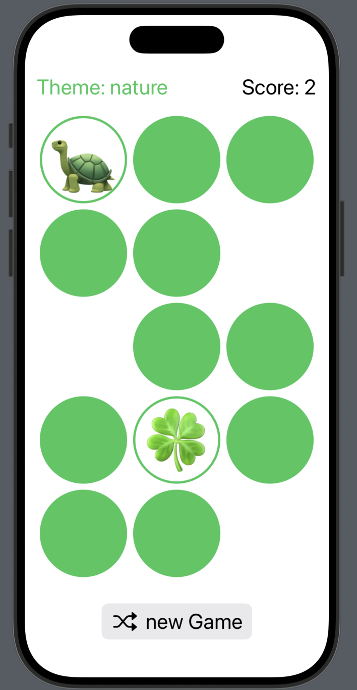

Memorize - Emoji Memory Game

Memorize is a small iOS game I created for the course cs193p. The goal is to match pairs of emoji cards by flipping them over and remembering their positions.

Features

-Themed Emoji Cards - Play with different themes and colors.
-Score Tracking - Gain points by matching pairs. Flipping cards that have previously been seen without matching is penalized
-Shuffle & Restart - Start a new game anytime with a randomized board.
-Animations - Flipping cards and shuffling is animated.

Screenshots
    

Installation
    
1.    Clone the repository: git clone https://github.com/yourusername/memorize-game.git
2.    Open the project in Xcode.
3.    Run on an iOS Simulator or a physical device.

How to Play

1.    Tap on a card to flip it over.
2.    Try to find the matching pair.
3.    Match all cards to win the game.
4.    Click the “New Game” button to shuffle and start a new game!

